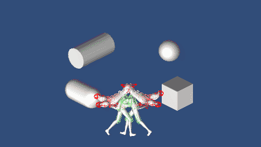
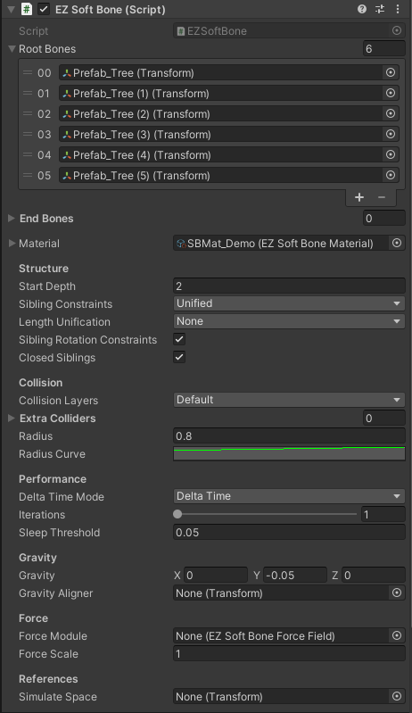
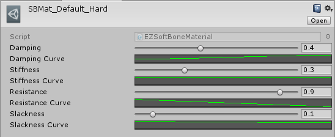
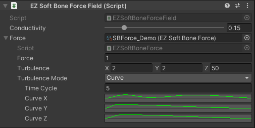
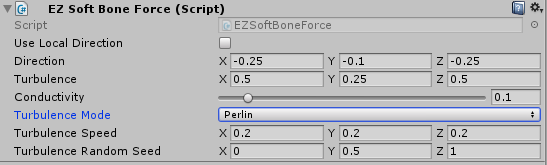

# EZSoftBone

This package is totally **FREE** and open-source.  
If you feel it helpful, you can buy it on [AssetStore](https://assetstore.unity.com/packages/slug/148136) to support me. Other than that, [Donations](https://github.com/EZhex1991/Receipts) are always welcome.

If you need a refund, send your Invoice Number to ezhex1991@outlook.com. **Refund for any reason will be accepted**.

EZSoftBone is a simple kinetic simulator for Unity, you can use it to simulate hair/tail/breast/skirt and other soft objects.

[View it on GitHub](https://github.com/EZhex1991/EZSoftBone)  
[查看中文介绍](README_CN.md)  

Tutorial Videos: https://space.bilibili.com/57392896/favlist?fid=1267164296&ftype=create

- All colliders supported (include MeshCollider)
- Net structure supported (Cloth simulation)
- Use EZSoftBoneMaterial to adjust effects, and reuse it on other EZSoftBones
- Inherit EZSoftBoneColliderBase to create custom colliders
- Beautiful wind simulator

## EZSoftBone

- Root Bones: a list of root bone Transforms
- End Bones: a list of end bone Transforms (useful for a hierarchy that has special parts, and you want to use different materials for these parts)
- Material: `EZSoftBoneMaterial`, default material will be used if not specified
- Structure
  - Start Depth: start depth of this system. (Transform will not be controlled if its depth is less than startDepth)
  - Sibling Constraints: add constraints to the nodes that have the same depth
    - None: no sibling constraints (chain simulation)
    - Rooted: use sibling constraints for each Root Bone separately
    - Unified: use sibling constraints for the entire SoftBone system
  - Length Unification: length calculation of this system, it determines how the radius and material parameters distributed on this system
    - None: compute each chain (length of the longest child chain will be used on the branches)
    - Rooted: each root use the length of its longest child chain
    - Unified: use the length of the longest chain for the entire system
  - Sibling Rotation Constraints: should sibling constraints affect rotations
  - Closed Siblings: check this to use closed loop circle
- Collision
  - Collision Layers: which layers should the system collide with
  - Extra Colliders: extra colliders (normal colliders required, this is for compatible purpose)
  - Radius: collider size
  - Radius Curve: how should the size distribute on the bones
- Performance
  - Delta Time Mode
    - Delta Time: UnityEngine.Time.deltaTime
    - Unscaled Delta Time: UnityEngine.Time.unscaledDeltaTime
    - Constant: a constant value can be specified
  - Iterations: how many times should the calculations done in one frame
  - Sleep Threshold: speed below this threshold will go to sleep (useful for high frame rate)
- Gravity
  - Gravity: gravity
  - Gravity Aligner: A transform can be specified to determine how much the gravity affects the system, inversely correlated to dot-production of aligner's y direction and world's y direction  
    - *eg: Create a new GameObject, leave its rotation unchanged (identical to the world space), drag it down to the head of a character, and set it as the aligner of the Hair system. You will see the grivity has no effect on the hair when the character stands still, and has maximum effect when the character lies down or bows*
    - To create a context menu to reset Transform's world rotation easily, Check this page: [EZTransformContextMenu](https://github.com/EZhex1991/EZUnity/blob/master/Assets/EZhex1991/EZUnity/Editor/ContextMenu/EZTransformContextMenu.cs)
- Force
  - Force Module: `EZSoftBoneForce`, wind simulation
  - Force Scale: the output amplification of ForceModule
- References
  - Simulate Space: A transform can be specified as a simulate space, it's useful when the system needs to be updated with a moving object (relatively static)  
    - *eg: a character in a moving car, hair should be relatively static to the car*

## EZSoftBoneMaterial

Assets/Create/EZSoftBone/SBMat

- Damping: speed attenuation
- Stiffness: shape retention
- Resistance: force resistence
- Slackness: length retention

Each value has a corresponding curve represent the value distribution on the bone hierarchy

## EZSoftBoneCollider

- Reference Collider: All types of colliders could be referenced, **EZSoftBoneCollider don't have to be on the same GameObject with its reference collider**
- Margin:
- Inside Mode: 

## EZSoftBoneForce

Assets/Create/EZSoftBone/SBForce

- Conductivity:
- Force: base force Strength (Z Direction)
- Turbulence: force turbulence vector
- Turbulence Mode:
  - Curve: (useful for explosioin simulation)
    - Turbulence Time Cycle: turbulence time cycle
    - Turbulence Curve: turbulence variation curves for each axis
  - Perlin: (useful for wind simulation)
    - Frequency: turbulence frequency for each axis
