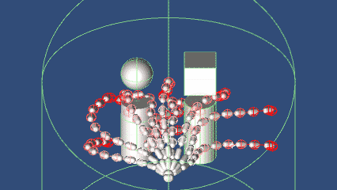
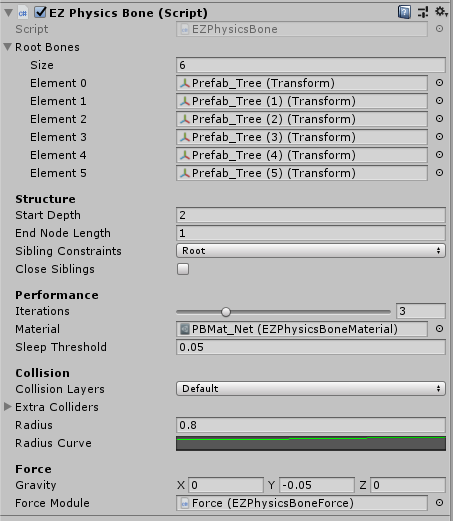
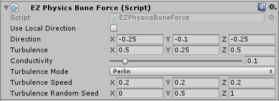

# EZPhysicsBone

[View it on GitHub](https://github.com/EZhex1991/EZPhysicsBone)  
[English Version](README.md)  

- 支持所有碰撞体（包括MeshCollider）
- 支持网状结构（模拟布料）
- 材质"EZPhysicsBoneMaterial"调节表现效果，可重用于多个EZPhysicsBone对象
- 继承EZPhysicsBoneColliderBase创建自定义碰撞

## EZPhysicsBone

- Root Bones: 骨骼根节点列表
- Structure
  - Start Depth: 从第几个层级开始起作用
  - End Node Length: 如果骨骼末端节点不在蒙皮末端，调节该数值补充节点，可以让蒙皮末端的朝向更加自然
  - Sibling Constraints: 同级约束，让深度相同的节点相互产生作用
    - None: 无同级约束（链）
    - Root: 约束同一个Root下深度相同的节点
    - Depth: 约束深度相同的节点
  - ClosedSiblings: 是否使用环状约束
- Performance
  - Iterations: 迭代计算的次数
  - Material: 使用的材质(`EZPhysicsBoneMaterial`)，如果不指定，运行时会自动使用默认材质
  - Sleep Threshold: 小于该值的速度会视为静止
- Collidsion
  - Collision Layers: 碰撞作用层
  - Extra Colliders: 让普通Collider也能起作用（本来是为了兼容老代码，不过有一定适用范围就保留了）
  - Radius: 骨骼的碰撞球大小
  - Radius Curve: 碰撞球大小的分布
- Force
  - Gravity: 应用于该骨骼的重力
  - Force Module: 应用于该骨骼的其他力（可用来模拟风）

## EZPhysicsBoneMaterial

- Damping: 阻力（数值越大速度衰减越快，显得更“飘”）
- Stiffness: 强度（数值越大形状越不容易改变，显得更“硬”）
- Resistance: 抗性（数值越大外力的作用越小，Gravity和ForceModule的效果降低）
- Slackness: 松弛度（数值越大长度越容易改变，更容易被拉伸）

每个数值对应一个Curve，代表不同骨骼位置的数值分布

## EZPhysicsBoneForce

- Use Local Direction: 使用相对于所在的Transform的方向
- Direction: 基础力的向量
- Turbulence: 动荡大小
- Conductivity: 传导性（可理解为风速）
- Turbulence Mode:
  - Curve:
    - Turbulence Time Cycle: 动荡周期
    - Turbulence Curve: 各方向的动荡曲线
  - Perlin:
    - Turbulence Speed: 2D柏林噪声在X方向上的移动速度
    - Random seed: 2D柏林噪声在Y方向上的采样位置
