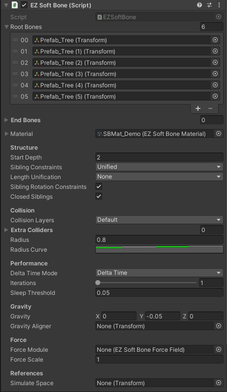
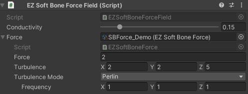

# EZSoftBone

该资源完全**免费**并开源。  
如果你觉得它对你有所帮助，你可以在[AssetStore](https://assetstore.unity.com/packages/slug/148136)上购买它来表示对作者的支持。或者，你可以选择其他方式表示[感谢](https://github.com/EZhex1991/Receipts)。

如果你需要退款，只需要发送你的购买凭据(Invoice Number)到我的邮箱ezhex1991@outlook.com即可。**任何理由的退款都会被接受**。

EZSoftBone是一个简单动力学模拟器，你可以用它实现自然的头发、尾巴、胸部、裙子等柔性物体的运动效果。

[View it on GitHub](https://github.com/EZhex1991/EZSoftBone)  
[English Version](README.md)  

视频教程: https://space.bilibili.com/57392896/favlist?fid=1267164296&ftype=create

- 支持所有碰撞体（包括MeshCollider）
- 支持网状结构（模拟布料）
- 材质"EZSoftBoneMaterial"调节表现效果，可重用于多个EZSoftBone对象
- 继承EZSoftBoneColliderBase创建自定义碰撞
- 自然风力模拟

## EZSoftBone

- Root Bones: 骨骼根节点列表
- End Bones: 末端节点列表（通常用在当你的柔性骨骼层级下面有一部分需要不同的参数时）
- Material: 使用的材质(`EZSoftBoneMaterial`)，如果不指定，运行时会自动使用默认材质
- Structure
  - Start Depth: 从第几个层级开始起作用
  - Sibling Constraints: 同级约束，让深度相同的节点相互产生作用
    - None: 无同级约束（链式结构）
    - Rooted: 约束同一个Root下深度相同的节点（每个RootBone是一个独立的网）
    - Unified: 约束整个系统中深度相同的节点（所有的RootBones形成一个网）
  - Length Unification: 树的总长度计算方式，参数的数值分布与该数值相关
    - None: 每个链单独计算（分叉点用最长子链的长度）
    - Rooted: 各Root使用其最长子链的长度
    - Unified: 使用整个系统中最长子链的长度
  - Sibling Rotation Constraints: 同级约束是否带动节点旋转
  - Closed Siblings: 是否使用闭合环状约束
- Collision
  - Collision Layers: 碰撞作用层
  - Extra Colliders: 让普通Collider也能起作用（本来是为了兼容老代码，不过有一定适用范围就保留了）
  - Radius: 骨骼的碰撞球大小
  - Radius Curve: 碰撞球大小的分布
- Performance
  - Delta Time Mode
    - Delta Time: UnityEngine.Time.deltaTime
    - Unscaled Delta Time: UnityEngine.Time.unscaledDeltaTime
    - Constant: 可指定固定值
  - Iterations: 迭代计算的次数
  - Sleep Threshold: 小于该值的速度会视为静止（高帧率时调节该数值防止异常抖动）
- Gravity
  - Gravity: 应用于该骨骼的重力
  - Gravity Aligner: 指定一个Transform作为重力的参考系，重力对骨骼系统的影响大小与参考系的Y轴和世界坐标系的Y轴的点乘成负相关  
    - *例：创建新物体保持其世界坐标下的旋转为0，拖拽到人物头部节点下，将其作为头发的Aligner，则人物站立时头发不受重力影响，躺下或低头时重力影响加大*
    - 创建菜单来轻松重置一个Transform的世界旋转，你可以参考这个页面：[EZTransformContextMenu](https://github.com/EZhex1991/EZUnity/blob/master/Assets/EZhex1991/EZUnity/Editor/ContextMenu/EZTransformContextMenu.cs)
- Force
  - Force Module: 应用于该骨骼的其他力（可用来模拟风）
  - Force Scale: 可以对ForceModule的输出进行缩放
- References:
  - Simulate Space: 指定一个Transform作为模拟计算的空间参考系，当骨骼系统需要和某个物体同时移动（相对静止）时使用  
    - *例：人坐在移动的车中，头发应保持相对静止*

## EZSoftBoneMaterial

Assets/Create/EZSoftBone/SBMat

- Damping: 阻力（数值越大速度衰减越快，显得更“飘”）
- Stiffness: 强度（数值越大形状越不容易改变，显得更“硬”）
- Resistance: 抗性（数值越大外力的作用越小，Gravity和ForceModule的效果降低）
- Slackness: 松弛度（数值越大长度越容易改变，更容易被拉伸）

每个数值对应一个Curve，代表不同骨骼位置的数值分布

## EZSoftBoneCollider

- Reference Collider: 所有类型的Collider都可以作为Reference，**EZSoftBoneCollider并不需要和它的ReferenceCollider在同一GameObject上**
- Margin:
- Inside Mode: 

## EZSoftBoneForce

Assets/Create/EZSoftBone/SBForce

- Conductivity: 传导性
- Force: 基础力的大小 (Z轴方向)
- Turbulence: 动荡大小
- Turbulence Mode:
  - Curve:（可用来模拟爆炸）
    - Turbulence Time Cycle: 动荡周期
    - Turbulence Curve: 各方向的动荡曲线
  - Perlin:（可用来模拟自然风）
    - Frequency: 各方向上动荡频率
